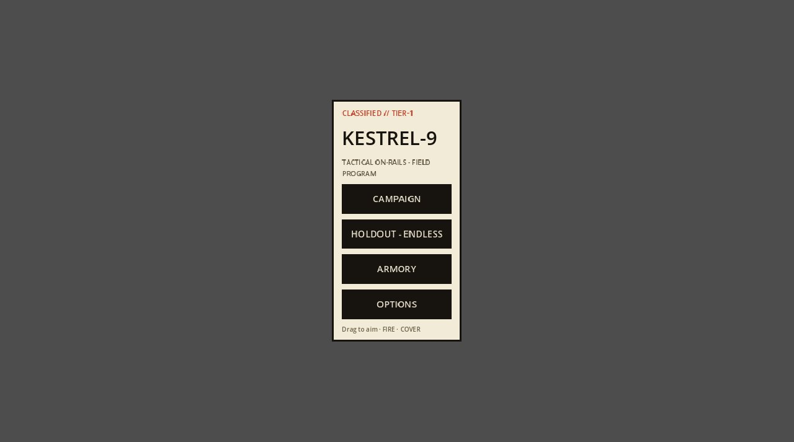

# KESTREL-9 (Godot)

The Godot 4 web build of KESTREL-9, a tactical on-rails shooter.



**Live:** https://aeiouvcode.github.io/kestrel9-godot/

## About

This repository hosts the exported web build of the Godot version of [KESTREL-9](https://github.com/aeiouvcode/kestrel-9): campaign, endless holdout, armory and options, rendered by the Godot engine through WebAssembly.

## Run locally

The build must be served over HTTP; browsers will not load the `.wasm` and `.pck` files from `file://`.

```sh
git clone https://github.com/aeiouvcode/kestrel9-godot.git
cd kestrel9-godot
python3 -m http.server 8000
```

Then open http://localhost:8000.

## Layout

```
index.html              Godot web shell
index.js                engine loader
index.wasm              Godot engine (WebAssembly)
index.pck               game data
index.audio.worklet.js  audio worklet
index.png, index.icon.png, index.apple-touch-icon.png   boot splash and icons
docs/                   README assets
```

These file names come from the Godot export and must stay as they are.
